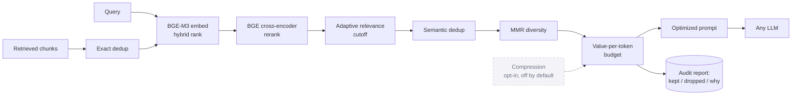

<div align="center">


# TokenGate

**Neural context optimization for LLM applications.**

Give it a query and a pile of retrieved chunks. TokenGate decides what to keep,
compress, and drop before the prompt reaches the LLM, and it records every
decision in a full audit report.

[](https://python.org)
[](https://github.com/Mario-Vishal/tokengate)
[](https://github.com/Mario-Vishal/tokengate)
[](https://mypy.readthedocs.io)
[](LICENSE)

</div>

---

## The problem

The default approach in RAG is to retrieve the top-k chunks and stuff them all into the prompt. That works until it doesn't: token limits blow up, irrelevant passages dilute the answer, and you have no idea what the model actually saw.

TokenGate replaces the stuffing step with a neural pipeline: embedding-based hybrid ranking, cross-encoder reranking, a per-query adaptive relevance cutoff, semantic deduplication, MMR diversity, and value-per-token budgeting. The token savings come from **deduplicating and selecting**, not from lossy compression (which ships **off by default**; [here's why](#why-compression-is-off-by-default)). The model gets a tighter, more relevant prompt, and you get a full audit of every decision it made along the way.

No generative LLM runs inside the pipeline. It's pure Python and runs offline.

---

## Results

Measured on a 20-query benchmark over a 29-document personal-docs corpus (utility bills, resumes, trip plans, vet records, wedding RSVPs), against a **modern** RAG baseline (retrieve, cross-encoder rerank, then stuff the top N), not a naive stuff-everything strawman:

| Metric | Result |
|---|---|
| **Context tokens (aggregate)** | **−71%** (29,397 down to 8,466 across all 20 queries) |
| **Answer regressions** | **0**. Every answer the baseline got right, TokenGate got right too |
| Median per-query reduction | **0%** (see below; this is the honest part) |
| Worst case | **1 of 20** queries came out slightly worse (+20 tokens) |

The savings aren't uniform, and that's worth being upfront about:

- On **focused, single-document lookups**, TokenGate ties the baseline (median 0%). The baseline already keeps one chunk, and so does TokenGate. Nothing clever happening, and nothing lost either.
- On **multi-document synthesis** queries, where a naive top-N dumps 9 to 20 redundant chunks, TokenGate cuts **90% or more**. For example, "compare the monthly charges across my utility bills" went from **7,903 tokens to 279** (19 blocks collapsed to 1).

The win comes from deduplication and selection, not from lossy compression.

### Why compression is off by default

TokenGate ships with an LLMLingua-2 learned-compression backend. In isolation it looks great: **72% token shrink with 100% of the fact strings retained.** But measured end to end, aggressive compression **broke answers**. At around 60% shrink it dropped the linking entity (a person's name) that tied a question to its document, and the model started replying "I can't find ..." to questions the full-text baseline answered correctly.

The fact strings survived; the answerability didn't. So compression is opt-in and off by default. Building it, measuring it honestly, catching the failure, and turning it off is the point. The alternative is shipping a number that looks good in a unit test and quietly breaks in production.

> **Benchmark caveat:** this is a single 20-query personal-docs corpus, not a large public eval. It's a representative, reproducible demo with an honest methodology, not a claim of universal SOTA. To reproduce it, see the [`beacon/`](https://github.com/Mario-Vishal/tokengate) benchmark harness.

---

## Install

```bash
pip install git+https://github.com/Mario-Vishal/tokengate.git
```

> **Models are downloaded on first use.** BGE-M3 (embedder) and BGE-Reranker-v2-m3 (cross-encoder) are fetched from Hugging Face automatically and cached locally (about 1 to 2 GB total). Requires Python 3.12 and PyTorch.

With the optional audit dashboard:

```bash
pip install "git+https://github.com/Mario-Vishal/tokengate.git#egg=tokengate[dashboard]"
```

---

## Quickstart

```python
from tokengate import TokenGate, TokenBlock

gate = TokenGate(strategy="balanced")

blocks = [
    TokenBlock(content="FastAPI is a modern Python web framework...", semantic_score=0.85),
    TokenBlock(content="Grocery list: bananas, milk, eggs...",        semantic_score=0.12),
    TokenBlock(content="FastAPI handles async requests efficiently...", semantic_score=0.79),
    # up to thousands of candidates
]

result = gate.optimize(
    query="How does FastAPI handle async requests?",
    blocks=blocks,
)

print(result.final_prompt)               # send this to any LLM
print(result.audit.tokens_saved)         # tokens cut by the pipeline
print(result.audit.tokens_saved_percent) # e.g. 74.3

for d in result.audit.decisions:
    print(d.block_id, d.decision, d.reason)
# abc123  included    high rerank score, within budget
# def456  dropped     semantic duplicate of abc123
# ghi789  dropped     below adaptive relevance cutoff
```

---

## Pipeline



The same stages, step by step:

```
  candidate blocks
        |
        v
   1.  exact dedup          remove byte-identical content
   2.  BGE-M3 embed         reuse stored vectors or compute fresh ones
   3.  hybrid rank          semantic + keyword + recency + source priority
   4.  BGE rerank           cross-encoder score per (query, chunk) pair
   5.  adaptive cutoff      keep blocks above THIS query's relevance cliff
   6.  semantic dedup       collapse near-paraphrases by cosine threshold
   7.  compress (opt-in)    LLMLingua-2 token compression, OFF by default
   8.  MMR selection        diversity-aware greedy final set
   9.  token budget         value-per-token fit within the context window
  10.  prompt build         stable/cacheable sections first, query last
  11.  audit                per-block decisions, per-stage trace, token math
        |
        v
   OptimizationResult
     .final_prompt        assembled prompt string, ready for any LLM
     .included_blocks     blocks kept in full
     .compressed_blocks   blocks with irrelevant sentences pruned
     .dropped_blocks      blocks that did not make it through
     .audit               full AuditReport with per-stage and per-block detail
```

---

## Strategies

| Strategy | What it does |
|---|---|
| `speed` | Skips the cross-encoder, loose dedup thresholds. Fastest. |
| `balanced` | Full pipeline with balanced weights. Default. |
| `quality` | Aggressive reranking, tight semantic dedup, higher relevance floor. |
| `max_compression` | The only preset with compression **on** (conservative `extractive` backend). For the aggressive LLMLingua-2 backend, also set `compression_backend="llmlingua2"` and `pip install "tokengate[compression]"`, and read [why compression is off in the default strategies](#why-compression-is-off-by-default) first. |

```python
gate = TokenGate(strategy="quality")
```

Fine-tune individual parameters:

```python
from tokengate.core.config import OptimizerConfig

gate = TokenGate(
    config=OptimizerConfig.for_strategy(
        "balanced",
        max_prompt_tokens=8192,
        rerank_top_n=30,
        relevance_floor=0.05,
        semantic_dedup_threshold=0.88,
        mmr_lambda=0.6,
    )
)
```

---

## Configuration

Every knob lives on `OptimizerConfig`. Set them in code, or keep them in a **`tokengate.toml`** file so thresholds can be tuned (by a teammate, or the dashboard) without touching code. Only the keys you list get overridden; everything else keeps its default.

```toml
# tokengate.toml
[tokengate]
strategy = "balanced"           # base preset to layer on top of; omit for the default
max_prompt_tokens = 8192
semantic_dedup_threshold = 0.88
mmr_lambda = 0.6
enable_compression = false      # off by default; see "Why compression is off" above

[tokengate.source_priorities]   # optional: weight sources in [0, 1]
desktop = 0.9
trash   = 0.1
```

Load it:

```python
from tokengate import TokenGate, OptimizerConfig

# Explicit path:
gate = TokenGate(config=OptimizerConfig.from_file("tokengate.toml"))

# Or auto-resolve. Order: explicit arg, then $TOKENGATE_CONFIG, then ./tokengate.toml, then built-in defaults
gate = TokenGate(config=OptimizerConfig.load())
```

**Where to put the file when you embed TokenGate in your app:** anywhere you like, then pass the path to `from_file()`. Or drop a `tokengate.toml` in your app's working directory (or point `$TOKENGATE_CONFIG` at it) and call `OptimizerConfig.load()`. Unknown keys raise, so a typo can't silently no-op, and every value is validated on load.

---

## Bring your own models

TokenGate ships with BGE-M3 and BGE-Reranker-v2-m3 as defaults. Swap them out by implementing two small protocols:

```python
from tokengate.models import EmbeddingModel, Reranker
import numpy as np

class MyEmbedder(EmbeddingModel):
    def embed(self, texts: list[str]) -> np.ndarray: ...

class MyReranker(Reranker):
    def rerank(self, query: str, texts: list[str]) -> list[float]: ...

gate = TokenGate(embedding_model=MyEmbedder(), reranker=MyReranker())
```

---

## Audit dashboard

Optimization is only trustworthy if you can see what it did. The `[dashboard]` extra adds a **standalone** local web UI (FastAPI + Chart.js) that turns every `optimize()` call into an inspectable record, so you can prove which chunks reached the model and why each one was kept or dropped.

```bash
pip install "tokengate[dashboard]"
```

### What it covers

- **Token savings per query:** candidate tokens in versus final-prompt tokens out, and the percentage saved.
- **Included / compressed / dropped donut:** the fate of every candidate block at a glance.
- **Pipeline drop-off funnel:** how many blocks (and tokens) survived each stage, from exact dedup through rerank, adaptive cutoff, semantic dedup, MMR, and budgeting. It shows exactly where context is lost.
- **Per-block decision table:** every block with its source, rerank score, token count, a content preview, and the reason it was kept or dropped (for example, "semantic duplicate of ..." or "below adaptive relevance cutoff").
- **The exact final prompt** sent to the LLM.
- **Session history:** browse and compare past queries, with a per-session trend line.

### Record and serve

```python
from tokengate import TokenGate
from tokengate.dashboard import AuditStore

store = AuditStore("audits.db")        # SQLite; defaults to ./tokengate_audits.db
gate  = TokenGate(strategy="balanced")

result = gate.optimize(query, blocks)
store.record("session-1", query, result, label="my-app", config={"strategy": "balanced"})

store.serve_dashboard(port=8080)       # blocking; opens the browser automatically
```

`label` is an optional human identifier for the session (your app name, a run id, a user). It becomes the session's title in the sidebar so runs are easy to tell apart. Without it, the session is titled by its first query.

Or point the CLI at any saved store:

```bash
python -m tokengate.dashboard                       # serves ./tokengate_audits.db on :8080
python -m tokengate.dashboard --store ./audits.db --port 8093
python -m tokengate.dashboard --no-browser          # don't auto-open a browser
```

| Flag | Default | Purpose |
|---|---|---|
| `--store PATH` | `./tokengate_audits.db` | SQLite audit store to serve |
| `--port N` | `8080` | HTTP port |
| `--host` | `127.0.0.1` | Bind address |
| `--no-browser` | off | Don't auto-open the browser |
| `--beacon-sync` | off | Also import audits from the [Beacon](https://github.com/Mario-Vishal/tokengate) desktop app, if installed |

It's fully standalone, so nothing else needs to be running. Beacon integration is strictly opt-in via `--beacon-sync`.

---

## Requirements

| | |
|---|---|
| Python 3.12 | Pinned for ML wheel compatibility |
| PyTorch | GPU optional, CPU fallback is automatic |
| sentence-transformers | Loads BGE-M3 and BGE-Reranker-v2-m3 |
| NVIDIA GPU | Optional. Speeds up embedding and reranking. |

GPU install (CUDA 12.8):

```bash
pip install git+https://github.com/Mario-Vishal/tokengate.git
pip install torch --index-url https://download.pytorch.org/whl/cu128
```

---

## Development

```bash
git clone https://github.com/Mario-Vishal/tokengate.git
cd tokengate
uv sync                      # Python 3.12 venv + all deps

uv run pytest                # 236 tests, 4 GPU-only skipped
uv run ruff check src tests  # lint (clean)
uv run mypy src              # strict type checking (clean)
```

All three are green on a fresh clone. GPU integration tests download real models on the first run:

```bash
uv run pytest -m gpu
```

---

## License

[MIT](LICENSE)
