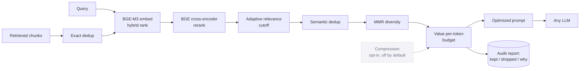
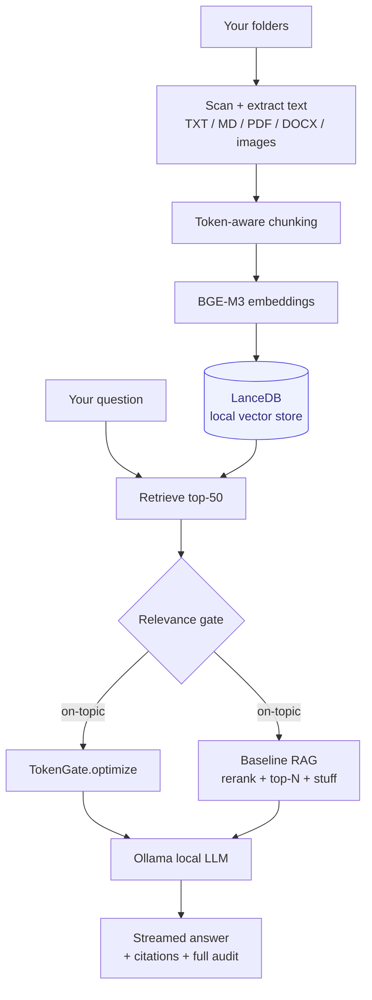

# Diagrams

These render on GitHub as-is. To export a PNG or SVG for a Medium article or a LinkedIn
post, paste the code block into <https://mermaid.live> and use Actions > Export.

## TokenGate pipeline

## Beacon system (local RAG app using TokenGate)

