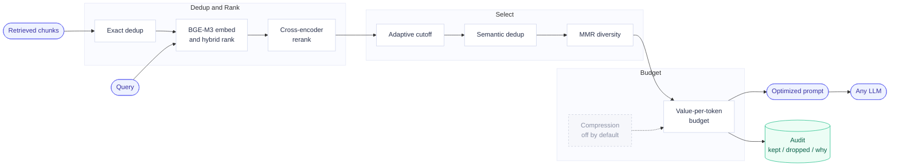
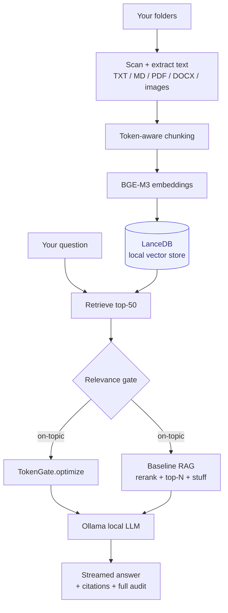

# Diagrams

These Mermaid diagrams render natively on GitHub. For the Medium article, open the pipeline
block at <https://mermaid.live> and export a PNG (Actions > Export), so the repo and the
article share the exact same diagram.

## TokenGate pipeline

## Beacon system (local RAG app using TokenGate)

